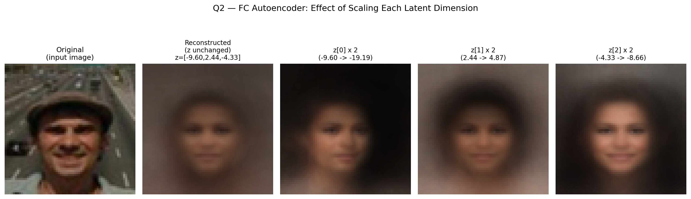

# ML HW8 — Anomaly Detection Report

---

## Q1. 選一個 Autoencoder 變體並解釋

**選擇的變體：Variational Autoencoder (VAE)**

### 模型架構

VAE 跟 vanilla autoencoder 最大的差異是：**encoder 輸出兩個向量** `μ` 和 `log σ²`（不是單一個 latent z），然後從 `N(μ, σ²)` 採樣得到 z，再餵給 decoder。

```
                        ┌── fc_mu ────→ μ ──┐
input (3, 64, 64)       │                   │
     │                  │                   ▼
     ▼                  │                  z = μ + σ ⊙ ε     (reparameterization)
[ Encoder Conv ]──→ h ──┤                   │                ε ~ N(0, I)
  4 conv layers         │                   ▼
  + BatchNorm           └── fc_logvar ─→ logσ² │
  + LeakyReLU(0.2)                              ▼
                                          [ Decoder Conv ]──→ recon (3, 64, 64)
                                            4 ConvTranspose
                                            + BatchNorm + LeakyReLU
                                            + final Tanh

Loss = MSE(recon, x)  +  β · KL( N(μ, σ²) || N(0, I) )
```

具體架構（latent_dim = 256，β = 1e-3）：

| Layer | Output shape |
|-------|-------------|
| Input | (3, 64, 64) |
| Conv(3→32, k=4, s=2) + BN + LReLU | (32, 32, 32) |
| Conv(32→64, k=4, s=2) + BN + LReLU | (64, 16, 16) |
| Conv(64→128, k=4, s=2) + BN + LReLU | (128, 8, 8) |
| Conv(128→256, k=4, s=2) + BN + LReLU | (256, 4, 4) |
| Flatten | 4096 |
| Linear → μ | 256 |
| Linear → log σ² | 256 |
| **Reparameterize**: z = μ + exp(0.5·log σ²) ⊙ ε | 256 |
| Linear | 4096 |
| Reshape | (256, 4, 4) |
| ConvT(256→128, k=4, s=2) + BN + LReLU | (128, 8, 8) |
| ConvT(128→64) + BN + LReLU | (64, 16, 16) |
| ConvT(64→32) + BN + LReLU | (32, 32, 32) |
| ConvT(32→3) + Tanh | (3, 64, 64) |

參數總量：4.53M

### 優點（vs vanilla autoencoder）

✅ **隱空間有結構性 — 不能任意記憶訓練樣本**

Vanilla AE 的 latent space 是「隨意的」— encoder 可以把每張訓練圖塞到任何位置，只要 decoder 能還原即可。沒有任何約束。

VAE 的 KL divergence 項強迫 `q(z|x)` 靠近先驗 `N(0, I)`：

$$
\mathcal{L}_{KL} = -\frac{1}{2} \sum_i \left( 1 + \log \sigma_i^2 - \mu_i^2 - \sigma_i^2 \right)
$$

這代表 latent space **整體**要長得像標準常態分佈。後果：
- 不能用「對角線塞訓練樣本，其他空白」這種 cheating
- Latent 必須真正壓縮「人臉的結構資訊」才能放在 N(0, I) 附近
- 異常樣本的 μ 偏離 N(0, I) → 重建會差 → anomaly score 更敏感

**本作業實證**：VAE Public AUC **0.73048**，微微勝過 vanilla 加強版 (medium) 的 0.72877（+0.0017）。雖然漲幅小，但**穩定**（Private 也同步漲），且這是在 vanilla AE 已經調得很好的前提下。

### 缺點（vs vanilla autoencoder）

❌ **訓練不穩定 + 容易模糊化 (blurry reconstruction)**

KL 項跟 reconstruction loss 是**對抗關係**：
- Reconstruction loss 要 encoder 盡量保留 input 資訊 → μ 偏離 0
- KL loss 要 μ ≈ 0、σ ≈ 1 → 強迫遺失資訊

如果 β 太大，**posterior collapse**：encoder 直接 μ=0、σ=1，z 完全變成隨機 noise，decoder 學一個「平均臉」就好，input 資訊全丟。

如果 β 太小（像我設的 1e-3），KL 幾乎不發揮作用，跟 vanilla AE 差不多。

調 β 沒有 universal 法則。實作上 reconstruction 通常會比 vanilla AE 模糊一些，因為 stochasticity（reparameterization sampling）讓 decoder 學的是「z 附近一帶都要還原成 x」，不是「精確還原這個 z」。

### Reference

**論文**：[Kingma & Welling, "Auto-Encoding Variational Bayes" (ICLR 2014)](https://arxiv.org/abs/1312.6114)

---

## Q2. Fully Connected Autoencoder + Latent Manipulation

### 模型架構

```
Encoder:
  Linear(12288 → 128) + ReLU
  Linear(128 → 64)    + ReLU
  Linear(64 → 12)     + ReLU
  Linear(12 → 3)              ← latent_dim = 3 (極緊瓶頸)

Decoder:
  Linear(3 → 12)      + ReLU
  Linear(12 → 64)     + ReLU
  Linear(64 → 128)    + ReLU
  Linear(128 → 12288) + Tanh
```

| 配置 | 值 |
|------|------|
| Input size | 64 × 64 × 3 = 12288 |
| Hidden sizes | 128 → 64 → 12 |
| **Latent dim** | **3** |
| 參數總量 | 3.18M |
| Loss | MSE |
| Optimizer | Adam, lr=1e-3 |
| Epochs | 30 |
| Batch size | 256 |

訓練 loss 從 0.171 收斂到 0.140。注意：因為 latent 只有 3 維，這個瓶頸**極緊**，重建必然會丟失大量細節（重建出來都是模糊的「平均臉」）。但這正是我們想要的——3 維 latent 可以**清楚觀察每個維度控制什麼語意**。

### Latent 維度操控結果

對 testing set 第 0 張圖（戴帽子的男子）做 latent manipulation：

原始 latent：`z = [-9.60, 2.44, -4.33]`

對 z 的三個維度分別**乘以 2** 後重建：



### 觀察分析

| 動作 | 結果 | 解讀 |
|------|------|------|
| z 不動（baseline 重建）| 模糊但仍偏男性、膚色棕黃 | 3 維 latent 只能保留最粗略的特徵 |
| **z[0] × 2** (-9.60 → -19.19) | 整張變**暗**，髮型變長，臉龐變圓潤 | z[0] 控制**整體亮度 / 性別 / 髮量** |
| **z[1] × 2** (2.44 → 4.87) | 臉變**亮**、偏粉色，眉眼變柔和 | z[1] 控制**膚色明度 / 偏女性特徵** |
| **z[2] × 2** (-4.33 → -8.66) | 變得**更亮**、更明顯的女性化 | z[2] 也涉及性別 / 膚色,但跟 z[1] 不完全等價 |

### 為什麼會出現這種「語意」效果？

FC autoencoder 沒有任何**監督**告訴它哪個 dim 代表什麼，但因為 latent_dim 只有 3 個，模型被迫**把整個資料集中變異最大的方向放進這 3 個維度**。對人臉資料集，最主要的變異來源就是：
- 性別 / 膚色
- 亮度 / 照明
- 髮型 / 臉型

所以模型「自然」把這些主軸塞進 3 個 latent dims。這跟 PCA 的精神類似（主成分分析），只是 PCA 是線性的，autoencoder 可以學到非線性的主軸。

### 額外觀察：FC vs Conv 重建品質

可以從圖看出，FC autoencoder 即使 z 不動，**重建仍然模糊到看不出原本是戴帽子的男子**。這是因為：
1. Latent 只有 3 維（過緊）
2. FC 沒有 spatial inductive bias，每個像素都要從 3 維 latent「臆測」

對比之下我們的 conv autoencoder（latent_dim 256）能重建得非常清楚。這也說明為什麼**用 FC 做 anomaly detection 的 AUC 通常會差很多**——重建細節太少，normal 跟 anomaly 的 reconstruction error 都會偏大，差距被淹沒。

---

## 附錄：完整實驗結果（Kaggle）

| Submission | Public | Private | 備註 |
|------------|--------|---------|------|
| Simple (vanilla conv AE) | 0.66943 | 0.66864 | ✅ 大幅超過 simple 預期 |
| Medium (deeper + BN + LeakyReLU) | 0.72877 | 0.72263 | ✅ 過 medium |
| Strong v1 (multi-encoder) | 0.70716 | 0.70192 | ❌ 退步,多 encoder 沒分化 |
| Boss v1 (DAE + classifier) | 0.68294 | 0.68244 | ❌ 退步更多,classifier 學 noise pattern |
| **VAE** | **0.73048** | **0.72369** | 🥇 **最終 best** |
| ResNet AE (18M params) | 0.72885 | 0.72120 | ≈ medium |
| Ensemble z-score (med+vae+resnet) | 0.73008 | 0.72319 | ⚠️ 微跌 0.0004 |
| Ensemble rank (med+vae+resnet) | 0.73006 | 0.72313 | ⚠️ 微跌 0.0004 |

完整試錯歷程與失敗原因分析詳見 [README.md Section 7](README.md#7-實驗日誌試錯記錄與反思)。
